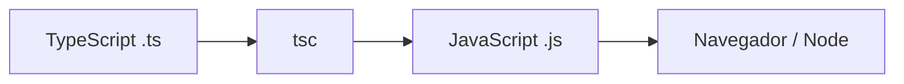
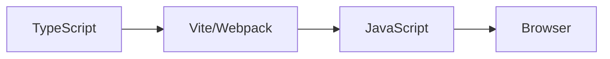

# Secomp 2026 - Minicurso TypeScript

---

# Primeiramente, Quem Sou Eu?

- Rubens Pinheiro Gonçalves Cavalcante
- Vice President Lead Software Engineer @ JP Morgan Chase
- Ex Facebook / Meta
- ~18 anos trabalhando com TI, 5 anos na Alemanha, quase 5 no Reino Unido
- Usando TypeScript desde sua versão 1.0 (~2015)
- Turma 2007.2 Ciência da Computação - UECE

---

# Módulo I

Introdução • Setup • Sintaxe • Build

## Agenda

- O que é TypeScript?
- Compilador TypeScript
- VSCode + TS Server
- Sintaxe básica
- tsconfig
- Hello World
- Integração com bundlers

---

# O que é TypeScript?

## TypeScript é um superset do JavaScript

- Todo JS válido também é TS válido
- Mas TS no é um JS válido

## O que o TS adiciona?

- Tipagem estática
- Melhor autocomplete
- Refatoração segura
- Melhor DX
- Mais previsibilidade

---

# Mas qual o problema do JavaScript?

JavaScript é flexível.

Às vezes... flexível até demais:

```js {monaco-run}
function sum(a, b) {
  return a + b;
}

console.log(sum("10", 20));
```

---

# JavaScript vs TypeScript

## JavaScript

```js
function sum(a, b) {
  return a + b;
}
```

<div h-8 />

## TypeScript

```ts
function sum(a: number, b: number): number {
  return a + b;
}
```

---

# Erros antes da execução

```ts twoslash
function exibirNome(nome: string) {
  console.log(nome.toUpperCase());
}

exibirNome(10);
```

<div h-4 />

---

# Como o TS funciona?



O compilador TypeScript (`tsc`) é responsável por:

- realizar a checagem de tipos
- transpilar TypeScript para JavaScript
- gerar diferentes formatos de módulos

O código gerado pode utilizar:

- ESM (EcmaScript Modules)
- CommonJS (Node.js)
- UMD (Universal Module Definition)

---

# Instalando TypeScript

```bash
npm install -D typescript
```

ou

```bash
pnpm install -D typescript
```

ou

```bash
yarn add -D typescript
```

---

# Inicializando projeto TS

Utilizaremos o cliente npx (utilitario do npm para executar binarios) e passar a flag de inicialização para o compilador:

```bash
npm install -D typescript
npx tsc --init
```

Isso cria o arquivo de config padrão:

```txt
tsconfig.json
```

Obs: Veremos mais a frente sobre ele e como funciona

---

# Sintaxe Básica

## Primitivos

```ts twoslash
const name: string = "Lucas";
const age: number = 30;
const active: boolean = true;
```

---

# Arrays

```ts
const numbers: number[] = [1, 2, 3];

const names: string[] = ["Ana", "João"];
```

---

# Objetos

```ts
const user: {
  name: string;
  age: number;
} = {
  name: "Lucas",
  age: 30,
};
```

---

# Tipos e Interfaces

```ts {monaco}
type User = {
  name: string;
  age: number;
};

interface Address {
  postCode: string;
  city: string;
  country: string;
}
```

---

# Usando tipos e interfaces

```ts {monaco}
type User = {
  name: string;
  age: number;
};

interface Address {
  postCode: string;
  city: string;
  country: string;
}

const user: User = {
  name: "Lucas",
  age: 30,
};

const address: Address = {
  postCode: "123-456",
  city: "Fortress",
  country: "Republic of IT",
};
```

---

# Afinal qual a diferença?

Type é mais poderoso

type consegue representar:

- unions
- primitives
- tuples
- mapped types
- conditional types

(Veremos todos no modulo 2)

---

# Interfaces foram construidos ao redor de Classes

E herda muito de onde TS se baseou, o C#. Por exemplo, isso é valido:

```ts {monaco-run}
interface User {
  name: string;
}

interface User {
  age: number;
}

class UserImpl implements User {
  name: string = "";
  age: number = 0;
}
```

Interfaces se mesclam em um escopo de mesmo namespace, dessa forma alteraçöes de
interface podem ser expandidas mais facilmente.

---

# E interfaces podem ser extendidas

Conceitos básicos de herança:

```ts twoslash
interface Person {
  name: string;
}

interface Citzen extends Person {
  country: string;
}

const citzen: Citzen = {
  name: "Rubens",
  country: "Brasil",
};

const person: Person = citzen;
```

---

# Takeout

## Minha opinião: use somente Types

Types conseguem fazer tudo o que interfaces fazem, porém o inverso
não é verdadeiro.

### Mas nunca... nunca?

Em casos especificos como bibliotecas, interfaces fornecem mais facilidades (e menos boilerplate) para extensão, nesses casos pode
ser considerado.

---

# Funções

```ts {monaco}
function sum(a: number, b: number): number {
  return a + b;
}
```

---

# Void

```ts {monaco}
function log(message: string): void {
  console.log(message);
}
```

---

# Optional Parameters

```ts {monaco}
function greet(name?: string) {
  console.log(name);
}
```

---

# Auto inferência

```ts {monaco}
const language = "TypeScript";
```

O TS entende automaticamente:

```ts
string;
```

---

# Inferência em funções

```ts {monaco}
function multiply(a: number, b: number) {
  return a * b;
}
```

O retorno é inferido automaticamente.

---

# Type Aliases

```ts {monaco}
type ID = string | number;

const userId: ID = 10;
```

---

# Union Types

```ts {monaco}
let value: string | number;

value = "hello";
value = 10;
```

---

# Literal Types

```ts {monaco}
type Theme = "dark" | "light";

const theme: Theme = "dark";
```

---

# Any

```ts {monaco}
let value: any = 10;

value = "hello";
value = true;
```

⚠️ Evite usar `any`

---

# Unknown

```ts {monaco}
let value: unknown;

value = "hello";
value = 10;
```

Mais seguro que `any`.

---

# Voltando ao tsconfig

Vamos abrir e ver o que foi gerado:

<div max-h-80 overflow-auto>

```json twoslash
{
  // Visit https://aka.ms/tsconfig to read more about this file
  "compilerOptions": {
    // File Layout
    // "rootDir": "./src",
    // "outDir": "./dist",

    // Environment Settings
    // See also https://aka.ms/tsconfig/module
    "module": "nodenext",
    "target": "esnext",
    "types": [],
    // For nodejs:
    // "lib": ["esnext"],
    // "types": ["node"],
    // and npm install -D @types/node

    // Other Outputs
    "sourceMap": true,
    "declaration": true,
    "declarationMap": true,

    // Stricter Typechecking Options
    "noUncheckedIndexedAccess": true,
    "exactOptionalPropertyTypes": true,

    // Style Options
    // "noImplicitReturns": true,
    // "noImplicitOverride": true,
    // "noUnusedLocals": true,
    // "noUnusedParameters": true,
    // "noFallthroughCasesInSwitch": true,
    // "noPropertyAccessFromIndexSignature": true,

    // Recommended Options
    "strict": true,
    "jsx": "react-jsx",
    "verbatimModuleSyntax": true,
    "isolatedModules": true,
    "noUncheckedSideEffectImports": true,
    "moduleDetection": "force",
    "skipLibCheck": true
  }
}
```

</div>

---

# Muita informação, vamos focar no básico:

```json
{
  "compilerOptions": {
    "target": "esnext", // Precisamos polyfill para APIs nao suportadas?
    "module": "nodenext", // Sistema de modulos do output
    "strict": true, // Checagens como noImplicitAny, strictNullChecks, etc
    "rootDir": "./src", // Raiz do codigo fonte
    "outDir": "./dist", // Diretorio de saida
    "sourceMap": true // Sourcemaps, normalmente usado em ambiente de desenvolvimento
  }
}
```

---

# Estrutura básica

Normalmente seu projeto vai iniciar mais ou menos assim:

```txt
project/
├── src/
│   └── index.ts
├── dist/
├── package.json
└── tsconfig.json
```

---

# Primeiro arquivo TS

## `src/index.ts`

```ts {monaco-run}
const message: string = "Olá Secomp!";

console.log(message);
```

---

# Compilando

```bash
npx tsc
```

Resultado:

```txt
dist/index.js
```

---

# Output

## JavaScript gerado

```js {monaco}
"use strict";
Object.defineProperty(exports, "__esModule", { value: true });
const message = "Olá Secomp!";
console.log(message);
//# sourceMappingURL=index.js.map
```

<div h-8 />

## Tipos gerados

Nao expomos nenhum tipo, entao isso é gerado 'vazio'

```ts {monaco}
export {};
//# sourceMappingURL=index.d.ts.map
```

---

# Setup: VSCode + TypeScript

O VSCode possui integração nativa com TypeScript.

Você ganha:

- autocomplete
- inferência
- quick fixes
- refatoração
- validação em tempo real

---

# O VSCode usa: TypeScript Server (tsserver)

Responsável por:

- entender tipos
- validar código
- sugerir correções

---

# Exemplo de correção simples:

```ts twoslash
const user = {
  name: "Lucas",
};

user.email;
```

O VSCode acusa o erro imediatamente!

---

# Hello World completo

## `src/index.ts`

```ts
interface User {
  name: string;
}

const user: User = {
  name: "Lucas",
};

console.log(`Hello ${user.name}`);
```

---

# Compilando e executando

```bash
npx tsc
node dist/index.js
```

---

# Integração com Bundlers

Hoje o TS normalmente roda junto com bundlers.

Exemplos:

- Webpack
- Vite
- Parcel
- esbuild

---

# Webpack + TS

Instalando dependências:

```bash
npm install -D \
  webpack \
  webpack-cli \
  ts-loader
```

---

# Exemplo webpack.config.js

```js
module.exports = {
  entry: "./src/index.ts",
  module: {
    rules: [
      {
        test: /\.ts$/,
        use: "ts-loader",
      },
    ],
  },
};
```

---

# Alternativa moderna: Vite

```bash
npm create vite@latest
```

Escolher:

```txt
TypeScript
```

---

# Por que Vite é popular?

- Muito rápido
- Setup simples
- TS nativo
- Excelente DX

---

# Fluxo moderno

Substituimos tsc pelo bundler:



<div h-8 />

## Mas ainda usamos o tsc?

Sim, normalmente utilizaremos não para transpilar, mas para checagem de tipos limpa:

```bash
tsc --noEmit
```

Assim antes de compilar o projeto inteiro, podemos checar (por exemplo, na Integração Contínua) se existe erros no projeto.

---

# Recapitulando

Hoje vimos:

- O que é TS
- Compilador
- VSCode
- Tipos básicos
- Interfaces
- Funções
- tsconfig
- Build
- Bundlers

---

# Próximo módulo

## TypeScript Avançado

- Generics
- keyof
- mapped types
- conditional types
- utility types

---

# Obrigado 🚀
