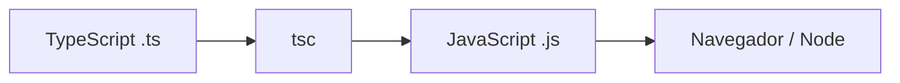

# Como o TS funciona?

O compilador TypeScript (`tsc`) é responsável por:

- realizar a checagem de tipos
- transpilar TypeScript para JavaScript
- gerar diferentes formatos de módulos

O código gerado pode utilizar:

- ESM (EcmaScript Modules)
- CommonJS (Node.js)
- UMD (Universal Module Definition)
