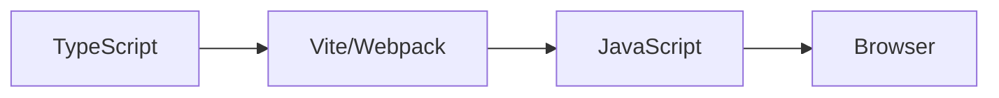

# Fluxo moderno

Substituimos tsc pelo bundler:



<div h-8 />

## Mas ainda usamos o tsc?

Sim, normalmente utilizaremos não para transpilar, mas para checagem de tipos limpa:

```bash
tsc --noEmit
```

Assim antes de compilar o projeto inteiro, podemos checar (por exemplo, na Integração Contínua) se existe erros no projeto.
